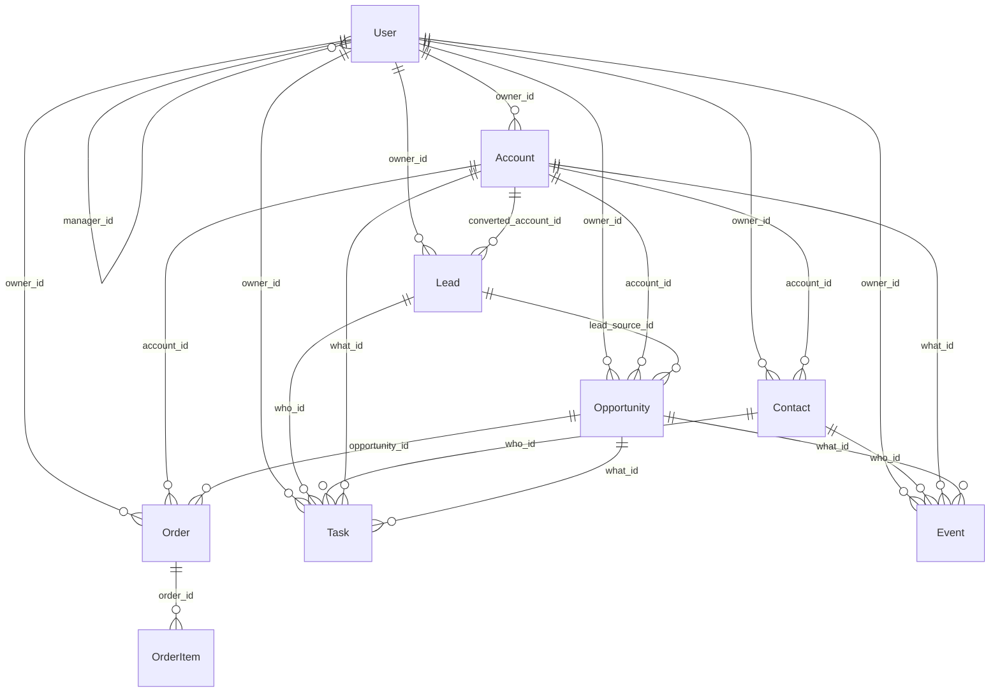

# Salesforce Sales Org Simulation Dataset

Synthetic Salesforce-style sales operations data for analytics practice, BI demos, and model prototyping.

This dataset mirrors common CRM workflows across accounts, leads, contacts, opportunities, orders, and sales activities.

## Files Included

All files are in `sample_data/csv`.

- `user.csv` - 275 rows
- `account.csv` - 10,000 rows
- `lead.csv` - 14,000 rows
- `contact.csv` - 18,500 rows
- `opportunity.csv` - 16,000 rows
- `order.csv` - 9,200 rows
- `order_items.csv` - 41,400 rows
- `tasks.csv` - 110,000 rows
- `event.csv` - 38,000 rows

## Dataset Overview

- **Users (`user.csv`)**: Sales employees with role hierarchy (`manager_id`) and ownership metadata.
- **Accounts (`account.csv`)**: Company/customer records with owner, industry, and location attributes.
- **Leads (`lead.csv`)**: Prospect records with conversion tracking (`is_converted`, `converted_account_id`, `converted_contact_id`, `converted_opportunity_id`).
- **Contacts (`contact.csv`)**: Person-level records tied to accounts.
- **Opportunities (`opportunity.csv`)**: Pipeline deals linked to accounts and optionally source leads.
- **Orders (`order.csv`)**: Commercial outcomes tied to opportunities and accounts.
- **Order Items (`order_items.csv`)**: Product-level order line details.
- **Tasks (`tasks.csv`)**: Activity records such as calls, emails, and follow-ups.
- **Events (`event.csv`)**: Calendar-style activities such as meetings and demos.

## Key Relationships

- `user.id` -> owner references across account, lead, contact, opportunity, order, task, and event.
- `lead.converted_account_id` -> `account.id`
- `lead.converted_contact_id` -> `contact.id`
- `lead.converted_opportunity_id` -> `opportunity.id`
- `contact.account_id` -> `account.id`
- `opportunity.account_id` -> `account.id`
- `opportunity.lead_source_id` -> `lead.id`
- `order.account_id` -> `account.id`
- `order.opportunity_id` -> `opportunity.id`
- `order_items.order_id` -> `order.id`
- `tasks.who_id` -> `lead.id` or `contact.id`
- `tasks.what_id` -> `account.id` or `opportunity.id`
- `event.who_id` -> `contact.id`
- `event.what_id` -> `account.id` or `opportunity.id`

## Entity relationship diagram

`Lead` also has optional `converted_contact_id` and `converted_opportunity_id` to **Contact** and **Opportunity** when a lead is converted. `Task.who_id` is a **Lead** or **Contact**; `Task.what_id` is an **Account**, **Opportunity**, or empty. `Event.who_id` is always a **Contact**; `Event.what_id` is an **Account** or **Opportunity**.

## Suggested Kaggle Use Cases

- Lead-to-opportunity-to-order conversion funnel analysis
- Pipeline stage progression and closed-won performance by rep role
- Activity effectiveness (tasks/events) vs opportunity outcomes
- Account and owner segmentation for revenue forecasting exercises
- Sales productivity and ownership distribution analysis

## Data Notes

- This dataset is fully synthetic and generated for learning/testing.
- No real customer or employee data is included.
- Values and distributions are realistic for analytics practice but not production truth.

## Generation

Generator script: `sample_data/python/generate_salesforce_sample_data.py`

AI support used: Codex 5.3